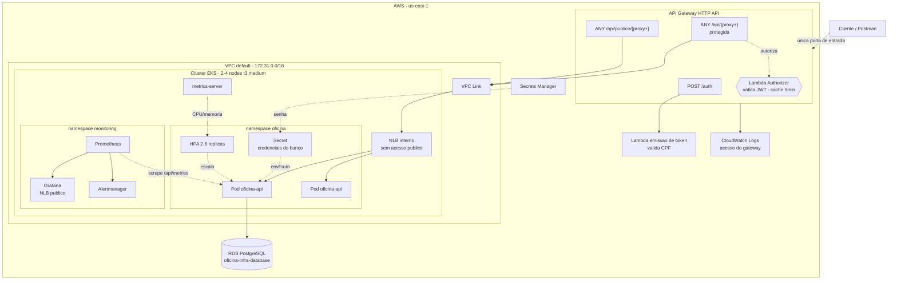

# oficina-infra-k8s

Provisionamento do **cluster Kubernetes, do API Gateway e da stack de observabilidade** da Oficina API — Tech Challenge SOAT, Fase 3.

Este repositório entrega a plataforma onde a aplicação roda. Ele **não** contém código de aplicação: o `Deployment` e o `HPA` pertencem ao repositório [`oficina-api`](https://github.com/fdacmatheus/oficina-api).

## Tecnologias

- **Terraform** `>= 1.9` com backend remoto em **S3** + lock em **DynamoDB**
- **Amazon EKS** 1.31 com node group gerenciado e escalabilidade
- **Amazon API Gateway** (HTTP API) com **VPC Link** e **Lambda authorizer**
- **kube-prometheus-stack** — Prometheus, Alertmanager e Grafana
- **GitHub Actions** para CI/CD

## Arquitetura



## Decisões de projeto

**O NLB da aplicação é interno.** Não existe caminho de rede que alcance os pods sem passar pelo API Gateway. Um NLB `internet-facing` seria mais simples de montar, mas tornaria o gateway contornável e esvaziaria o requisito de proteger as rotas sensíveis. O acesso se dá por **VPC Link**.

**Authorizer Lambda em vez do authorizer JWT nativo.** O authorizer JWT do API Gateway exige um emissor **OIDC** com JWKS público. O token do sistema é assinado em HS256 pela própria function serverless, então a validação é feita por um authorizer do tipo `REQUEST`, com `authorizer_result_ttl_in_seconds = 300` para reduzir invocações e latência.

**Roles do Learner Lab referenciadas por `data`, não criadas.** O AWS Academy não concede `iam:CreateRole`. As roles `LabEksClusterRole` e `LabEksNodeRole` já vêm provisionadas e são consumidas por nome — esse é o ajuste que quebra a maioria dos tutoriais de EKS neste ambiente.

**VPC default, sem NAT Gateway.** Um NAT Gateway custa ~US$ 32/mês e consumiria dois terços do crédito do laboratório. As subnets públicas da VPC default atendem, e a segurança é mantida pelos security groups e pelo NLB interno.

**`us-east-1e` é excluída dinamicamente.** Essa AZ não suporta EKS; o filtro está em `locals.eks_subnet_ids`.

**ServiceMonitor e PrometheusRule entregues via values do Helm.** Declará-los com `kubernetes_manifest` exigiria que as CRDs do prometheus-operator já existissem no momento do `plan`, o que impossibilita um `apply` a partir do zero. O chart os renderiza depois de instalar as próprias CRDs.

**Prometheus + Grafana em vez de Datadog ou New Relic.** O enunciado deixa a escolha livre. A stack no cluster não exige cadastro externo nem chave de licença, não consome crédito adicional e — o ponto decisivo — permite versionar os **dashboards como código** neste repositório, de modo que qualquer pessoa reproduz o ambiente inteiro com um `terraform apply`.

## Observabilidade

### Dashboards

Versionados em [`dashboards/`](dashboards) e carregados pelo sidecar do Grafana.

| Dashboard | Painéis |
| --- | --- |
| **Oficina · Negócio** | Volume diário de OS, tempo médio de execução por status, distribuição por status, transições por minuto, erros nas integrações |
| **Oficina · Plataforma** | Uptime, latência p50/p95 por rota, throughput por status HTTP, CPU e memória dos pods, réplicas vs. carga (HPA), reinícios por probe, autenticação serverless |

### Alertas

| Alerta | Severidade | Condição |
| --- | --- | --- |
| `ApiIndisponivel` | critical | `up == 0` por 2 min |
| `PodsReiniciandoEmLoop` | warning | > 3 reinícios em 15 min |
| `LatenciaAlta` | warning | p95 > 1s por 5 min |
| `TaxaErro5xxAlta` | critical | > 5% de 5xx por 5 min |
| `HpaNoTeto` | warning | réplicas no máximo por 10 min |
| `FalhaProcessamentoOrdemServico` | critical | qualquer erro ao processar OS em 10 min |
| `FalhaIntegracaoNotificacao` | warning | > 5 falhas de e-mail em 15 min |
| `OrdensParadasAguardandoAprovacao` | info | > 20 OS paradas por 30 min |

### Logs

Os logs de acesso do API Gateway saem em **JSON estruturado** para o CloudWatch, incluindo `requestId`. A aplicação propaga esse mesmo identificador no campo `correlationId` dos seus logs, permitindo rastrear uma requisição da borda até o handler.

## Execução

### Pré-requisitos

- Terraform `>= 1.9`, `kubectl`, `aws` CLI
- O repositório [`oficina-infra-database`](https://github.com/fdacmatheus/oficina-infra-database) **já aplicado** — este repo lê o state dele

### Deploy

```bash
terraform init
terraform apply
```

A criação leva de **15 a 20 minutos** (control plane ~10 min, node group ~3 min, stack de observabilidade ~5 min).

### Acessar

```bash
# kubectl
aws eks update-kubeconfig --name oficina-eks --region us-east-1
kubectl get nodes

# URL pública do sistema
terraform output api_gateway_url

# Grafana (usuário admin)
kubectl -n monitoring get svc kube-prometheus-stack-grafana \
  -o jsonpath='{.status.loadBalancer.ingress[0].hostname}'
```

### Habilitar a proteção das rotas

O authorizer só é criado quando os ARNs das Lambdas são informados. Depois de aplicar o repositório `oficina-lambda-auth`:

```bash
terraform apply \
  -var="lambda_authorizer_arn=arn:aws:lambda:us-east-1:679445922616:function:oficina-auth-authorizer" \
  -var="lambda_token_arn=arn:aws:lambda:us-east-1:679445922616:function:oficina-auth-token"
```

Sem eles, as rotas ficam abertas — útil para validar a conectividade antes de somar a camada de autenticação.

### Testar a escalabilidade

```bash
kubectl -n oficina get hpa -w

# em outro terminal
hey -z 3m -c 80 "$(terraform output -raw api_gateway_url)/api/health"
```

Acompanhe o painel **Escalabilidade — réplicas vs. CPU** no dashboard de Plataforma.

### Destruir

```bash
terraform destroy
```

> Rode o `destroy` assim que terminar. O control plane do EKS custa US$ 0,10/h e os dois nodes ~US$ 0,083/h — cerca de **US$ 4,40 por dia** ligado.

## Variáveis

| Variável | Padrão | Descrição |
| --- | --- | --- |
| `region` | `us-east-1` | Única região liberada no Learner Lab |
| `cluster_version` | `1.31` | Versão do Kubernetes |
| `node_instance_type` | `t3.medium` | Tipo dos nodes |
| `node_desired_size` / `min` / `max` | `2` / `2` / `4` | Escala do node group |
| `namespace` | `oficina` | Namespace da aplicação |
| `lambda_authorizer_arn` | `""` | Vazio desativa a proteção das rotas |
| `lambda_token_arn` | `""` | Vazio desativa a rota `POST /auth` |
| `grafana_admin_password` | `oficina-admin` | Senha do Grafana |

## Outputs

| Output | Consumido por |
| --- | --- |
| `api_gateway_url` | Postman, vídeo, smoke test do pipeline |
| `cluster_name` | `oficina-api`, para o `kubectl` do deploy |
| `namespace` | `oficina-api` |
| `subnet_ids` | `oficina-lambda-auth`, para a Lambda alcançar o RDS |
| `cluster_security_group_id` | `oficina-lambda-auth` |
| `nlb_hostname` | Diagnóstico de conectividade |

## CI/CD

[`.github/workflows/terraform.yml`](.github/workflows/terraform.yml)

| Gatilho | Ação |
| --- | --- |
| Pull Request | `fmt` + `validate` + validação dos dashboards + `plan` comentado no PR |
| Push em `homolog` | Apply em homologação |
| Push em `main` | Apply em produção + verificação dos nodes |
| `workflow_dispatch` com `destroy` | Destrói a infraestrutura |

**Secrets necessários**: `AWS_ACCESS_KEY_ID`, `AWS_SECRET_ACCESS_KEY`, `AWS_SESSION_TOKEN`.

## Repositórios relacionados

| Repositório | Papel |
| --- | --- |
| [`oficina-api`](https://github.com/fdacmatheus/oficina-api) | Aplicação principal em Kubernetes |
| [`oficina-infra-database`](https://github.com/fdacmatheus/oficina-infra-database) | RDS PostgreSQL gerenciado |
| [`oficina-lambda-auth`](https://github.com/fdacmatheus/oficina-lambda-auth) | Function serverless de autenticação por CPF |
